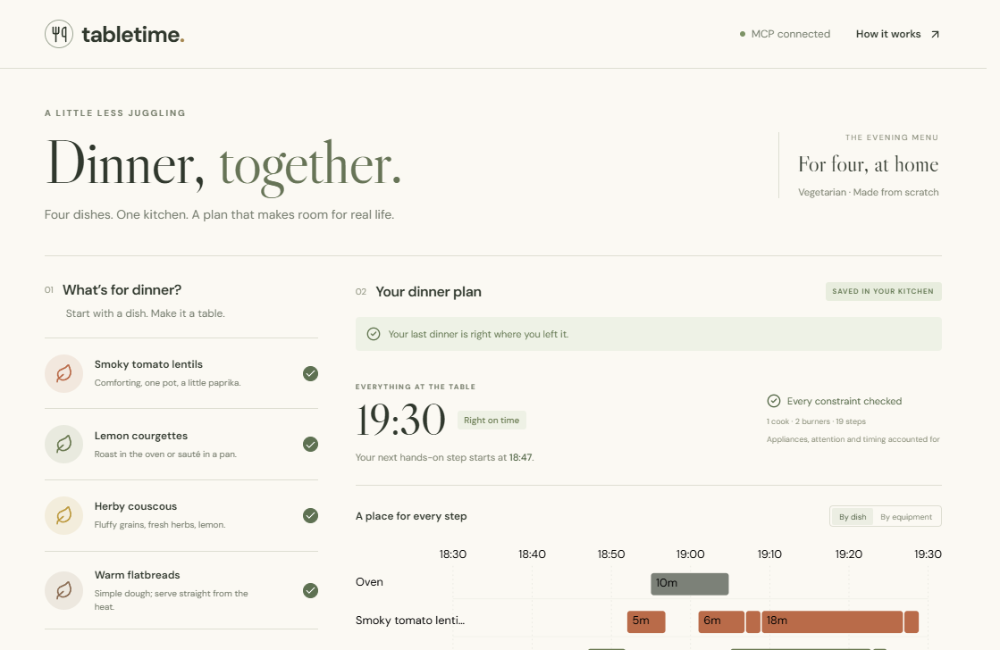

# Tabletime

**Dinner, together.** Four dishes share a cook, two burners and one oven. Tabletime finds a schedule, checks it independently, and repairs the remaining work when something changes.

[Try the browser demo](https://luoy16002-svg.github.io/tabletime/) · [Watch the working demo](https://youtu.be/MQEYI8HHiVQ) · [Source](https://github.com/luoy16002-svg/tabletime)



Built during September 2026 for the Alexa+ track of the Amazon Developer Hackathon. The entry uses the **self-hosted MCP server** path. It does not claim Alexa certification or an integration tested on an Echo device.

## Run the real MCP version

Node.js 24 recommended. No account, API key, paid service or special hardware.

```sh
npm ci
npm run build
npm start
```

Open **http://127.0.0.1:4318**. The **Under the lid** panel says **MCP connected** and calls the actual MCP tools with the official SDK client. Connect another Streamable HTTP MCP client to **http://127.0.0.1:4318/mcp**. Protocol negotiation is tested against **2025-11-25**.

The server deliberately binds to loopback and checks Host/Origin. It is a single-kitchen local prototype, not a public multi-tenant service. Saved plans live in `.tabletime/dinner.json`; `TABLETIME_STATE_DIR` and `PORT` can select a different local instance. No appliance is controlled.

The public demo runs the **same solver and kitchen state machine in a Web Worker**, with localStorage persistence. Its **Under the lid** panel is labelled _Private browser demo_. GitHub Pages hosts static files; it does not host the MCP endpoint. Fonts and solver assets are bundled; no analytics or model API is called.

## Try three things

1. Keep the four dishes, one cook, two burners and 19:30 target. Review the dish and equipment timelines, then choose **Use this plan**.
2. Choose **Lentils need 8 more minutes**. This explicitly simulates following the schedule up to simmering. Started steps stay fixed, the remaining work moves, and the later serving time is shown before confirmation.
3. Start a fresh dinner with **Plan my dinner**, accept it, then choose **The oven isn't available**. With this menu and its serving windows, one cook cannot fit the work. Review the independently checked two-cook alternative. Reload after confirmation to resume it.

Recipe timings and serving windows are illustrative. These are four original example recipes for four portions, not a tested recipe collection. Serving windows describe eating quality, **not food-safety guarantees**. There are no sensors, recipe imports, dietary guarantees, appliance controls or purchases.

## What is implemented

- Mixed-integer scheduling using HiGHS/WASM: alternative cooking methods, dependencies, exclusive cook/appliance lanes, blackouts, maximum waiting times and serving windows.
- Continuous cookware occupancy: consecutive phases of the same saucepan remain on the same burner, including hands-free simmering.
- Two-stage objective: first find the earliest feasible serving time at or after the requested target, then reduce waiting and disruption to the previous plan.
- Repair with fixed started work and revised durations. Timeout is distinguished from a proof of infeasibility; an unchecked incumbent is never presented.
- A separate interval checker verifies all returned assignments, dependencies, lane conflicts, blackouts, frozen history and serving constraints.
- Persisted proposals, explicit confirmation, revision checks and idempotency receipts. A proposal cannot silently change the active dinner. The most recent 100 request receipts are retained; request IDs must not be reused after expiry.

| MCP tool        | Purpose                                                   |
| --------------- | --------------------------------------------------------- |
| `kitchen_menu`  | Read recipes, methods and assumptions                     |
| `read_dinner`   | Resume current plan, revision and recent changes          |
| `draft_dinner`  | Solve and persist a proposal, without activating it       |
| `draft_repair`  | Propose a repair against an expected revision             |
| `accept_dinner` | Confirm a reviewed proposal with an idempotent request ID |

MCP tool descriptions tell a client to explain the proposal and obtain the cook's approval. The server enforces state and revision integrity; it cannot verify whether an arbitrary client really obtained human consent. A deployed assistant must implement its own confirmation UI.

## Reproduce the checks

```sh
npm test
npm run test:mcp
npm run benchmark
```

The tests include an independently written exhaustive oracle: **36 small mixed-mode instances match the optimal finish time**. Integration checks use the official MCP client over HTTP, inspect protocol negotiation, reject a foreign Origin, confirm/retry/stale-confirm proposals, repair a delay and verify persistence in a new server process.

[`artifacts/benchmark.json`](artifacts/benchmark.json) contains the full fixed-seed synthetic benchmark, hardware and settings. The recorded run uses 60 cases with 9–18 tasks and one second per optimization stage:

| Result                                                           |   Recorded value |
| ---------------------------------------------------------------- | ---------------: |
| Independently valid returned schedules                           |            60/60 |
| First-stage optimum proved within time budget                    |            24/60 |
| Mean finish, MILP                                                |    63.78 minutes |
| Mean finish, FIFO greedy                                         |    66.95 minutes |
| Mean finish, longest-first greedy                                |    68.80 minutes |
| Mean finish, best of 64 randomized priorities plus longest-first |    63.95 minutes |
| Median / p95 solve time                                          | 2,004 / 2,008 ms |

The mean improvement is **4.73% against FIFO and 0.26% against the stronger multistart baseline**. This is not evidence of a large optimization breakthrough or measured time savings in real kitchens. The contribution is the constraint model, independently checked repairs and complete stateful interaction. Eight illustrative kitchen configurations are also reported, including infeasible cases. Time-limited results can vary across machines.

## Interface and visual assets

The interface was developed from a full-page generated UI study, then implemented as real React components. [Design study](artifacts/ui-design.png) · [Design prompt](artifacts/ui-design-prompt.txt). Actual schedule bars, status, times and proposals always come from the solver, not the design image.

The five food illustrations are original generated assets, served locally as WebP (about 792 KB total). They are menu illustrations, not photographs of cooking trials. [Asset files and prompts](public/images/source.json). Desktop uses an interactive timeline; narrow screens use expandable step lists with the same real timings.

## Code map

`core/model.js` validates problems and checks schedules. `core/solver.js` builds the MILP. `core/recipes.js` defines the menu and repair semantics. `core/kitchen.js` owns persistent state. `server/index.js` exposes real Streamable HTTP MCP tools. `ui/` implements the display and browser worker; `scripts/` contains reproducible benchmarks and protocol checks.

The optional `?capture=1` recorder captures this app's rendered DOM to a silent WebM video, with manually entered captions. It does not access the microphone, webcam, desktop or other tabs.

## Limits and next work

Integer-minute timing; at most 48 tasks; fixed recipe assumptions and conservative oven preheating. The time-advance control simulates all steps whose planned start has passed. A real cooking companion needs explicit observed step completion, tested recipes, variable oven temperatures, authentication and per-household storage before wider deployment. No real cooking trials or user outcome study have been run.

## Integration friction log

These are observations from this build, not reports of an Amazon service outage. No Amazon device or hosted Alexa runtime was used.

| Attempt and reproduction | Expected / observed | Severity and workaround | Actionable improvement |
|---|---|---|---|
| Load the same HiGHS package in Node and a Vite Web Worker; run `npm run build`. | Expected an unambiguous browser entry. Vite reports `node:module` externalized for browser compatibility, although the browser WASM path works. | Low; use explicit worker/WASM asset URLs and verify the deployed worker independently. | HiGHS packaging could expose a browser-only entry and a current Vite worker example. |
| Install on Windows with the machine's configured npm mirror, commit the lockfile, then run `npm ci` on a clean GitHub runner. | Local installation succeeded. Clean CI failed with `Invalid Version:`; inspection found an optional Rolldown binding entry without a version. | High for reproducibility; generate the lockfile in an empty directory against the official registry, pin the project registry, then verify both Linux and Windows CI. The failure was an install/lockfile issue, not an MCP defect. | npm could identify the exact invalid lockfile entry in the error. CI should always include clean installs on the target platforms. |
| Bundle the React display with Lucide in Vite 8.3.0. | Expected a quiet build. Rolldown warns that dependency-level `use client` directives may not be preserved in this client-only app. | Low; inspect the warning and verify the client build. No directive stripping or global warning suppression was needed. | Distinguish harmless client-only dependency directives from server/client boundary errors in bundler diagnostics. |
| Connect an official MCP client, create a proposal, confirm it, retry the confirmation, then restart the server. | MCP transports the calls successfully, but application durability and confirmation semantics still need explicit implementation. This is a design boundary, not an SDK bug. | Important integration work; persisted revisions, proposals and bounded idempotency receipts are implemented and exercised by `npm run test:mcp`. | A reference example for stateful consumer workflows should include proposal/confirm, duplicate retries, stale confirmations and restart recovery together. |

Feature requests: **Important** — a small device-independent Alexa+ MCP conformance harness with exact protocol negotiation, confirmation UI behavior and reconnect/retry cases. **Nice-to-have** — a maintained browser display example sharing a schema with a self-hosted MCP server. These would help validate the consumer experience before device testing; neither is claimed to be an existing product defect.

MIT for this project's code. Dependency notices and bundled font licenses are preserved in [THIRD_PARTY_LICENSES.txt](public/THIRD_PARTY_LICENSES.txt) and the installed packages; React, Express, HiGHS, the MCP SDK, Zod, Lucide, html-to-image and Fontsource retain their respective licenses.
